# GameHub

<p align="center">
  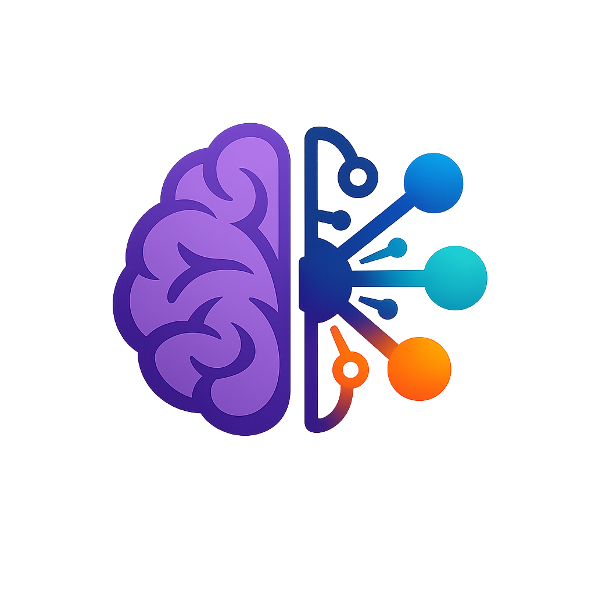
</p>

<p align="center">
  Desktop aplikace v Pythonu (PySide6), ktera sdruzuje logicke hry, AI moduly a tisk/PDF exporty do jednoho launcheru.
</p>

<p align="center">
  <a href="https://github.com/Esperosa/gamehub/releases"></a>
  <a href="LICENSE"></a>
  <a href="ARCHITECTURE.md"></a>
  <a href="docs/print_export_samples.md"></a>
</p>

<p align="center">
  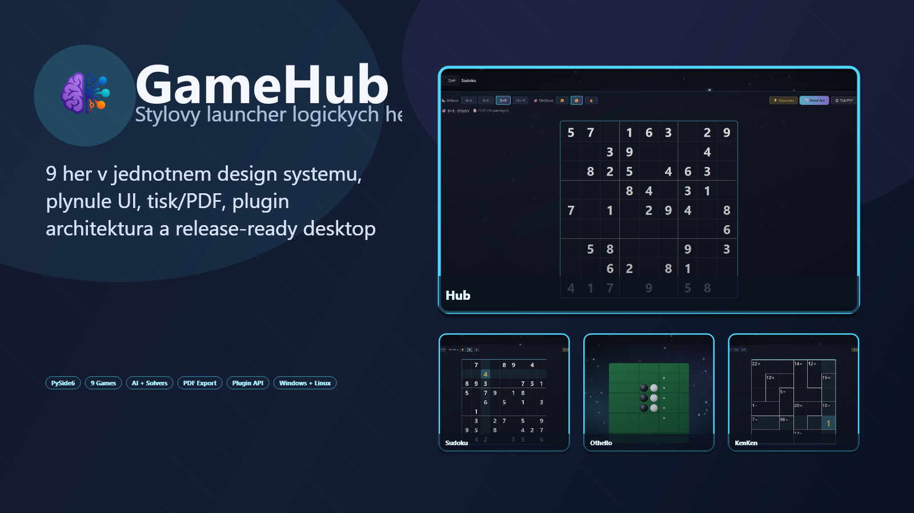
</p>

<p align="center">
  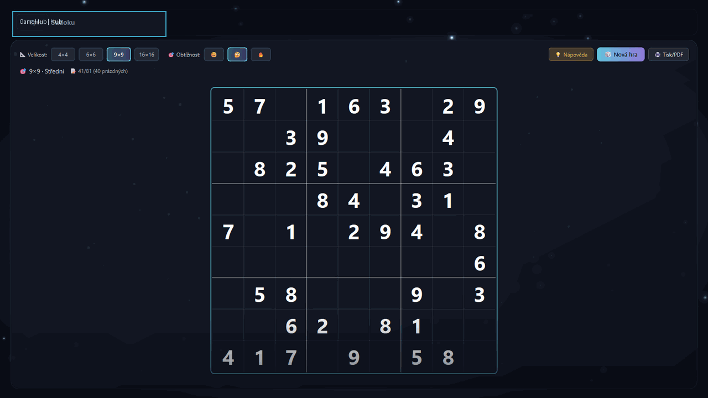
</p>

## Quick Links

| Download | Quick Start | Architecture | Print/PDF | Benchmarks |
|---|---|---|---|---|
| [Releases](https://github.com/Esperosa/gamehub/releases) | [Rychly start](#rychly-start) | [ARCHITECTURE.md](ARCHITECTURE.md) | [print_export_samples.md](docs/print_export_samples.md) | [benchmarks/README.md](benchmarks/README.md) |

## GitHub Branding

- Social preview obrazek: `docs/media/social_preview.png`
- README hero set: `docs/media/repo_hero.png` + `docs/media/showcase.gif`
- Regenerace assetu: `python scripts/generate_repo_branding.py --output-dir docs/media`
- Manual pro repo branding: `docs/repository_branding.md`

## Download

- Latest stable build: [GitHub Releases](https://github.com/Esperosa/gamehub/releases)
- Windows: `GameHub_*_windows_x64.exe` (+ `.zip`)
- Linux (optional): `GameHub_*_linux_x86_64` (+ `.tar.gz`)
- Každý release obsahuje `SHA256SUMS.txt` pro ověření integrity.

## Features

- 9 logických her v jednom launcheru (`2048`, `KenKen`, `Mastermind`, `Nonogram`, `Othello`, `Piškvorky`, `Simon`, `Slitherlink`, `Sudoku`)
- Plugin-first architektura (`games/<hra>/plugin.py`)
- Oddělené vrstvy `engine / solver / ui` pro každou hru
- Tisk/PDF export pro `Sudoku`, `KenKen`, `Slitherlink`
- One-file release pipeline (Windows + Linux artifacts + SHA256)

## Support Matrix

| Platform | Stav | Artefakt v Releases |
|---|---|---|
| Windows x64 | testováno | `.exe`, `.zip` |
| Linux x86_64 | optional (best effort) | binárka, `.tar.gz` |

## Screenshots

Aktuální screenshoty jsou generované z **lokální aktuální verze** přes `scripts/capture_screenshots.py`.
Každá hra je otevřená v hubu, rozehraná a pořízená ve stavu, kde jsou vidět všechny hlavní UI prvky.

Regenerace screenshotů:

```bash
.venv\Scripts\python scripts/capture_screenshots.py
```

Skript automaticky:
- otevře hub + všechny hry z aktuálního lokálního stromu,
- počká na dokončení async načítání puzzle,
- provede minimální rozehrání (hint/tah),
- ověří, že obrázky nejsou prázdné a mají validní rozměr.

Print dialog screenshoty + PDF sample exporty:

```bash
.venv\Scripts\python scripts/generate_print_assets.py --media-dir docs/media --sample-dir docs/samples
```

Branding hero/social preview assety:

```bash
.venv\Scripts\python scripts/generate_repo_branding.py --output-dir docs/media
```

| Hub | 2048 |
|---|---|
| 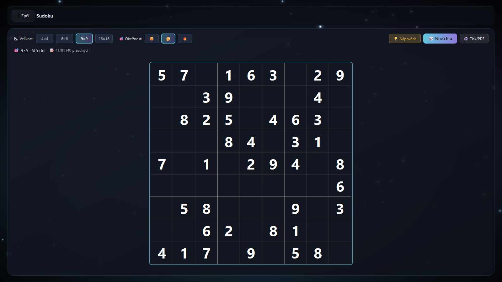 | 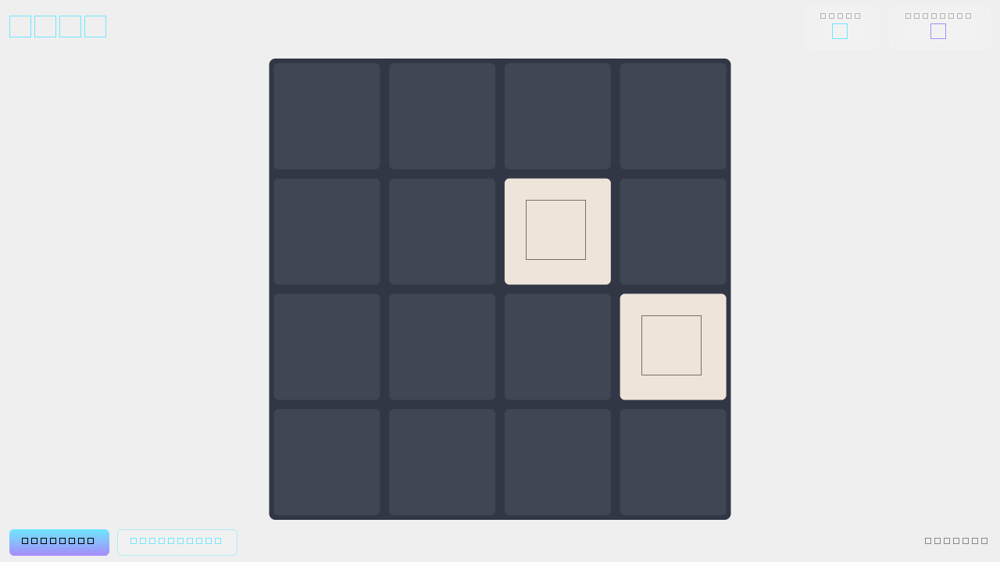 |

| KenKen | Mastermind |
|---|---|
| 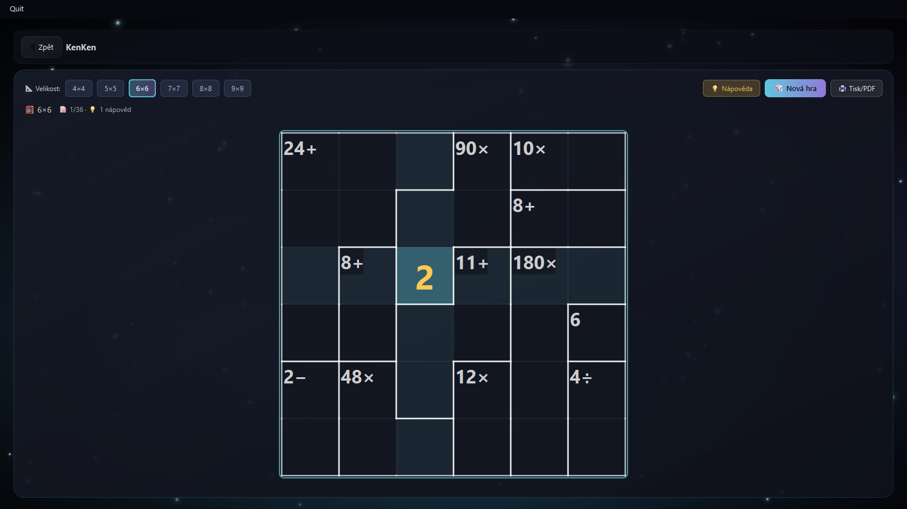 | 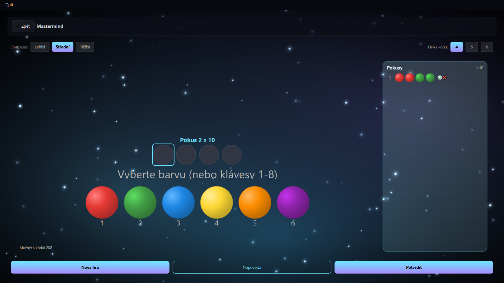 |

| Nonogram | Othello |
|---|---|
| 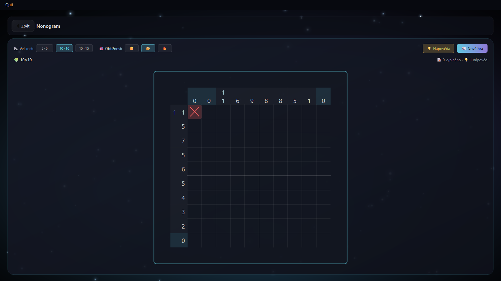 | 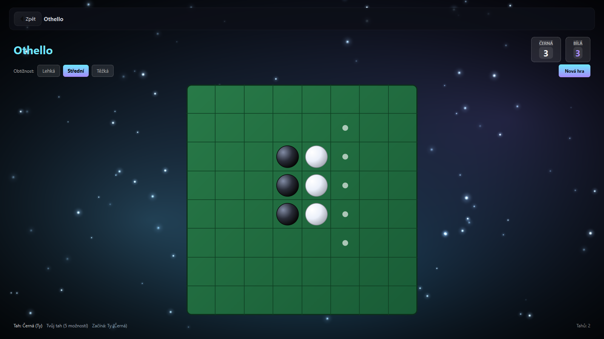 |

| Piškvorky | Simon |
|---|---|
| 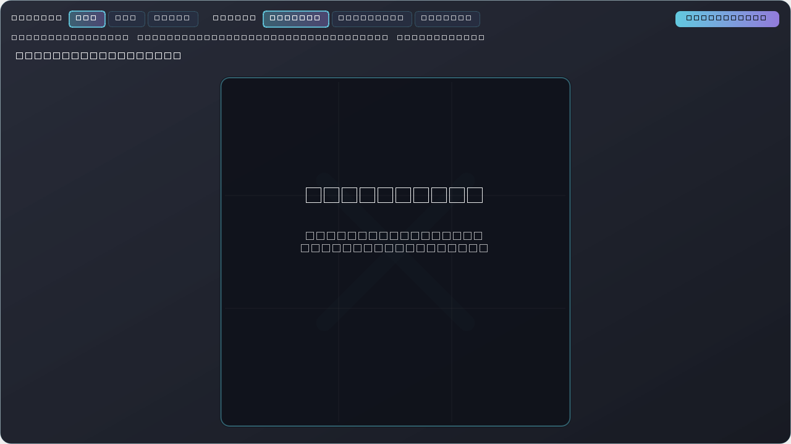 | 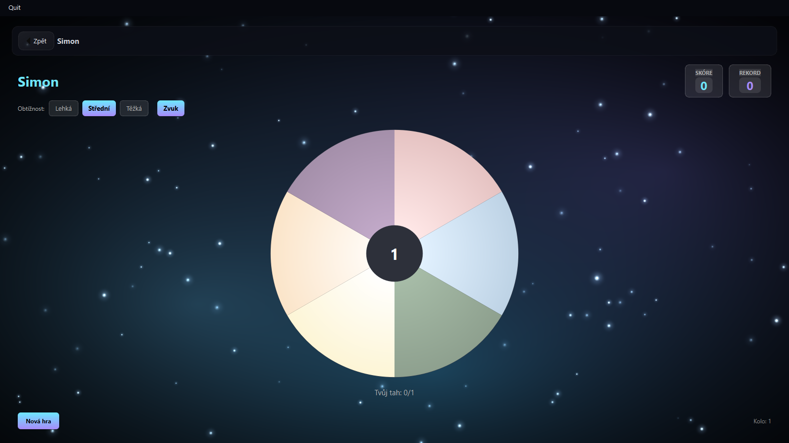 |

| Slitherlink | Sudoku |
|---|---|
| 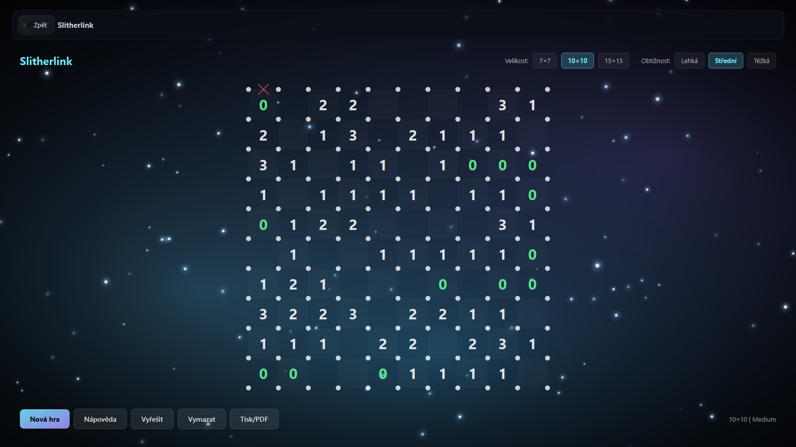 | 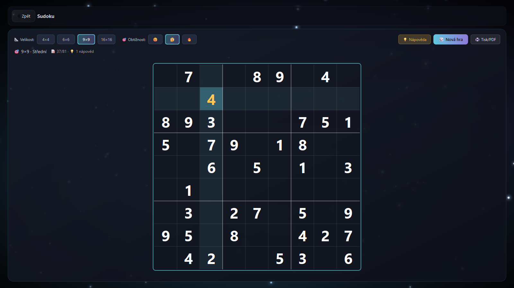 |

| Print Sudoku | Print KenKen | Print Slitherlink |
|---|---|---|
| 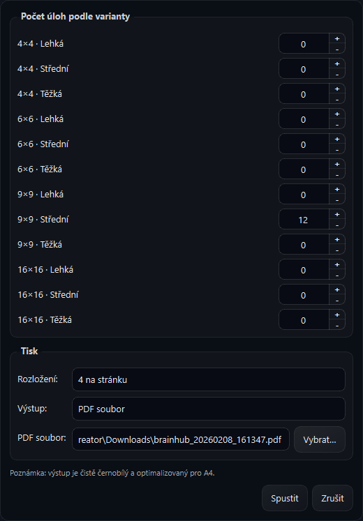 | 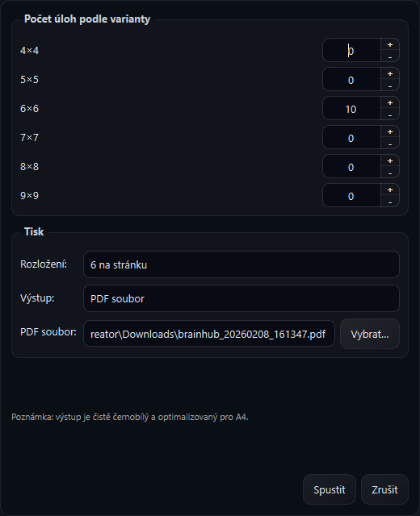 | 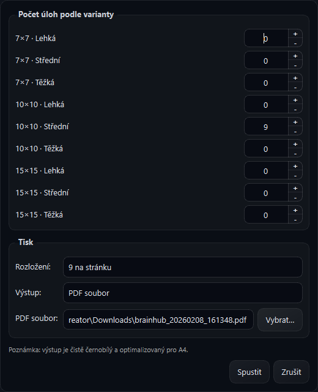 |

## PDF Export Samples

Ukázkové PDF exporty layoutů `1/2/4/6/9` na stránku:

- Sudoku:
  - [layout 1](docs/samples/sudoku_layout_1.pdf), [layout 2](docs/samples/sudoku_layout_2.pdf), [layout 4](docs/samples/sudoku_layout_4.pdf), [layout 6](docs/samples/sudoku_layout_6.pdf), [layout 9](docs/samples/sudoku_layout_9.pdf)
- KenKen:
  - [layout 1](docs/samples/kenken_layout_1.pdf), [layout 2](docs/samples/kenken_layout_2.pdf), [layout 4](docs/samples/kenken_layout_4.pdf), [layout 6](docs/samples/kenken_layout_6.pdf), [layout 9](docs/samples/kenken_layout_9.pdf)
- Slitherlink:
  - [layout 1](docs/samples/slitherlink_layout_1.pdf), [layout 2](docs/samples/slitherlink_layout_2.pdf), [layout 4](docs/samples/slitherlink_layout_4.pdf), [layout 6](docs/samples/slitherlink_layout_6.pdf), [layout 9](docs/samples/slitherlink_layout_9.pdf)

## Licence a autor

- Licence: [MIT](LICENSE)
- Copyright: `© 2026 BeakOverPink (Esperosa)`
- Maintainer: [@Esperosa](https://github.com/Esperosa)
- Právní metadata: `LICENSE`, `NOTICE`

## Documentation

- `ARCHITECTURE.md` - načítání pluginů, lifecycle, vrstvy hry, template pro novou hru
- `CONTRIBUTING.md` - dev setup, testy, coding style, contribution workflow
- `CHANGELOG.md` - verze a změny
- `docs/sudoku_generation_performance.md` - srovnání variant generování Sudoku 16x16 hard a výsledky benchmarku
- `docs/print_export_samples.md` - jak vznikají print dialog screenshoty a PDF sample exporty
- `docs/repository_branding.md` - jak regenerovat README hero/social preview assety
- `benchmarks/README.md` - benchmark artefakty a jejich kontext

## Co v aplikaci je

- Plugin architektura her (`games/<hra>/plugin.py`)
- 9 integrovaných her:
  - `game2048`
  - `kenken`
  - `mastermind`
  - `nonogram`
  - `othello`
  - `piskvorky`
  - `simon`
  - `slitherlink`
  - `sudoku`
- Moderní UI + animované pozadí
- Tisk/PDF generátor pro `sudoku`, `kenken`, `slitherlink`
- Build do `.exe` pro Windows

## Rychlý start

```bash
python -m venv .venv
.venv\Scripts\activate
pip install -r requirements.txt
python run.py
```

## Tester (audit run)

Pro jednotný audit všech her je k dispozici skript `tester.py`.

```bash
python tester.py
```

Volitelné režimy:

```bash
python tester.py --tests-only
python tester.py --plugins-only
python tester.py --adapters-only
```

`tester.py` automaticky:
- objeví pluginy v `games/`
- provede smoke kontrolu widgetu + lifecycle hooků
- spustí unit testy z `tests/`
- umí načíst i nové game-specific adaptéry přes `games/<game>/tester.py` s funkcí `run_audit()`

## Tisk a PDF (Sudoku, KenKen, Slitherlink)

V hrách `sudoku`, `kenken` a `slitherlink` je tlačítko `Tisk/PDF` pro dávkové generování tisknutelných úloh.

- Co umí:
  - Vygenerovat více úloh najednou podle zvolených variant (velikost/obtížnost).
  - Export do `PDF` nebo přímý tisk na tiskárnu.
  - Rozložení `1 / 2 / 4 / 6 / 9` úloh na stránku.
  - Černobílý A4 výstup se silným černým rámem puzzle.
- Výchozí nastavení dialogu:
  - Počty variant jsou `0` (uživatel vyplní přesně co chce).
  - Výstup je defaultně `PDF`.
  - Cesta pro PDF je defaultně složka `Downloads`.
- Ukázky:
  - Print dialog screenshoty: `docs/media/print_dialog_*.png`
  - PDF sample exporty: `docs/samples/*_layout_{1,2,4,6,9}.pdf`
  - Reprodukce: `docs/print_export_samples.md`
- Vzhled tisku:
  - Sudoku: čistá mřížka + zadané hodnoty.
  - KenKen: zvýrazněné klece a výraznější linky klecí.
  - Slitherlink: výrazné tečky vrcholů + číselné indicie.

## Jak hry fungují

Níže je praktický přehled pravidel, ovládání a interní logiky (AI/solverů).

### 2048

- Cíl:
  - Spojováním stejných číselných dlaždic dosáhnout hodnoty `2048` (nebo pokračovat dál).
- Ovládání:
  - `Šipky` nebo `W/A/S/D` pro tah.
  - Tlačítka `Nová hra`, `AI Vyřešit`.
- Funkce:
  - Plynulé animace, skóre, výhra/prohra overlay.
- Agent/AI:
  - Expectimax solver (`games/game2048/solver.py`) s heuristikami (gradient/snake pattern, smoothness).
  - Akcelerace přes Numba, adaptivní hloubka hledání.

### KenKen

- Cíl:
  - Vyplnit mřížku čísly `1..N` bez opakování v řádcích/sloupcích a splnit podmínky klecí (`+ - * /`).
- Ovládání:
  - Klik na buňku.
  - `1..9` zadání hodnoty, `Delete/Backspace/0` smazání.
  - `Šipky` pohyb po buňkách.
  - Kolečko myši cykluje hodnoty.
  - Tlačítka velikosti `4x4..9x9`, `Nápověda`, `Nová hra`, `Tisk/PDF`.
- Funkce:
  - Generace puzzle na pozadí, validace, hint systém.
  - Dávkový černobílý tisk/PDF s layoutem na A4.
- Agent/AI:
  - Constraint solver s MRV heuristikou + propagace omezení.
  - Unikátnost řešení se ověřuje při generaci.
  - Výpočty jsou optimalizované (Numba fallback na čistý Python).

### Mastermind

- Cíl:
  - Uhodnout tajný barevný kód.
  - Černé kolíky = správná barva i pozice, bílé = správná barva špatná pozice.
- Ovládání:
  - Klik na slot a barvu, nebo klávesy `1..8` pro rychlé zadání.
  - `←/→` změna slotu, `Enter` potvrzení, `Delete/Backspace` smazání.
  - Tlačítka `Nápověda`, `Potvrdit`, `Nová hra`.
  - Nastavení obtížnosti a délky kódu.
- Funkce:
  - Různé počty barev a pokusů podle obtížnosti.
- Agent/AI:
  - Hint používá minimax-like strategii (`suggest_guess`) nad množinou kompatibilních kódů.

### Nonogram

- Cíl:
  - Vyplnit správné buňky podle čísel u řádků/sloupců a odhalit obrazec.
- Ovládání:
  - Levé tlačítko: vyplnit.
  - Pravé tlačítko: označit jako prázdné (`X`).
  - Drag funguje pro rychlé vyplnění/označení.
  - Tlačítka velikosti (`5x5`, `10x10`, `15x15`), obtížnosti, `Nápověda`, `Nová hra`.
- Funkce:
  - Vizuální zvýraznění, konfety při dokončení.
- Agent/AI:
  - Line solver + constraint propagation.
  - Hint vrací determinovatelný krok; při potřebě fallback na hlubší řešení.

### Othello (Reversi)

- Cíl:
  - Mít na konci partie více kamenů své barvy.
  - Otáčíš soupeřovy kameny uzavřením mezi své kameny v osmi směrech.
- Ovládání:
  - Klik na zvýrazněný legální tah.
  - Tlačítko `Nová hra`, přepínač obtížnosti.
- Funkce:
  - Automatické pass tahy, skóre, game-over overlay.
- Agent/AI:
  - Minimax s alpha-beta pruning.
  - Adaptivní hloubka podle fáze hry + hodnocení mobility, rohů, hran, parity.

### Piškvorky / Gomoku

- Cíl:
  - Udělat souvislou řadu:
  - `3x3 -> 3 v řadě`, `8x8 -> 4 v řadě`, `13x13 -> 5 v řadě`.
- Ovládání:
  - Klik do mřížky.
  - Přepínač velikosti a obtížnosti.
  - `Nová hra`.
  - U režimu `13x13` je aktivní otevření Swap2 (volby přes overlay tlačítka).
- Funkce:
  - Async výpočty tahu bota (UI se neblokuje).
  - Statistiky/rating.
- Agent/AI:
  - `easy`: jednoduchá heuristika, dělá chyby.
  - `medium`: lehký minimax/alpha-beta (mělké hledání).
  - `hard`: iterativní prohledávání + alpha-beta + transposition table.
  - Prioritizace okamžité výhry, bloků a forků.

### Simon

- Cíl:
  - Zapamatovat a zopakovat rostoucí sekvenci barev.
- Ovládání:
  - Klik na segmenty kruhu.
  - Přepínač obtížnosti (`easy/medium/hard`), `Zvuk`, `Nová hra`.
- Funkce:
  - Zvukové tóny, skóre, high-score, vizuální efekty.
  - Režimy enginu: `classic`, `reverse`, `speed`, `chaos` (v UI je standardně vystavená hlavně obtížnost).
- Agent/AI:
  - Není protivník-bot; logika je deterministický engine sekvencí.

### Slitherlink

- Cíl:
  - Nakreslit jednu uzavřenou smyčku podle číselných indicií.
- Ovládání:
  - Klik na hranu cykluje stav: `prázdná -> čára -> X -> prázdná`.
  - Tlačítka velikosti (`7x7`, `10x10`, `15x15`), obtížnosti, `Nápověda`, `Vyřešit`, `Vymazat`, `Nová hra`, `Tisk/PDF`.
- Funkce:
  - Načítání/generace puzzle na pozadí.
  - Auto-solve animace.
  - Tisk/PDF s výraznými tečkami vrcholů a čitelnými indiciemi.
- Agent/AI:
  - Hinty přes constraint propagation.
  - Plný solver přes SAT (`python-sat`) s kontrolou validní jediné smyčky.

### Sudoku

- Cíl:
  - Vyplnit mřížku čísly podle pravidel Sudoku.
- Ovládání:
  - Klik na buňku.
  - `1..9` a pro větší varianty `A..Z`, `Delete/Backspace/0` smazání.
  - `Šipky` navigace.
  - Kolečko myši cykluje hodnoty.
  - Velikost (`4x4`, `6x6`, `9x9`, `16x16`), obtížnost, `Nápověda`, `Nová hra`, `Tisk/PDF`.
- Funkce:
  - Highlight konfliktů, průběh, konfety při dokončení.
  - Tisk/PDF čisté sudoku mřížky (černobílý A4 export).
- Agent/AI:
  - Backtracking solver s MRV + bitmask optimalizací.
  - Generátor vytváří puzzle z referenčního řešení a ověřuje alternativní řešení (unikátnost) s time-budgety.

## Struktura projektu

```text
run.py
hub/                # shell aplikace (okna, téma, widgety, loader pluginů)
games/              # jednotlivé hry jako pluginy
requirements.txt
```

## Přidání nové hry

1. Vytvoř složku `games/nazev_hry/`
2. Přidej `plugin.py`
3. V `plugin.py` exportuj `manifest = PluginManifest(...)`

## Build a Release Artifact

Windows:

```bash
.\scripts\build_windows.ps1 -Version v1.2.3
```

Linux:

```bash
bash ./scripts/build_linux.sh v1.2.3
```

Výstup (`dist/`):
- binární artefakt (`.exe` na Windows, ELF binárka na Linuxu)
- archiv (`.zip` nebo `.tar.gz`)
- checksum soubor (`SHA256SUMS_windows.txt` / `SHA256SUMS_linux.txt`)

Kompatibilní wrapper (legacy):

```bash
.\build_exe.ps1 -Version v1.2.3
```

## Packaging a Release

1. Označ release tag:

```bash
git tag v1.2.3
git push origin v1.2.3
```

2. GitHub Actions workflow `.github/workflows/release.yml` automaticky:
- sestaví Windows + Linux artefakty,
- spočítá SHA256 checksumy,
- publikuje GitHub Release s přílohami (`.exe`, `.zip`, `.tar.gz`, `SHA256SUMS.txt`).

3. Ověření checksumu po stažení:

```bash
sha256sum -c SHA256SUMS.txt
```

## Reproducible Build

- Runtime/build závislosti jsou zamknuté v `requirements-lock.txt`.
- Zdroj pro lock: `requirements-build.in`.
- Regenerace locku:

```bash
.venv\Scripts\python -m piptools compile requirements-build.in --output-file requirements-lock.txt --generate-hashes --allow-unsafe
```

## Kvalita kódu

Instalace dev nástrojů:

```bash
.venv\Scripts\python -m pip install -r requirements-dev.txt
```

Lint + formatter:

```bash
.venv\Scripts\python -m ruff check .
.venv\Scripts\python -m ruff format .
```

Typová kontrola (hub + plugin API + engine modely):

```bash
.venv\Scripts\python -m mypy
```

Pre-commit hooky:

```bash
.venv\Scripts\python -m pre_commit install
.venv\Scripts\python -m pre_commit run --all-files
```

## Poznámka

`dist/`, `.venv/` a další build/cache artefakty jsou záměrně ignorované v `.gitignore`.
