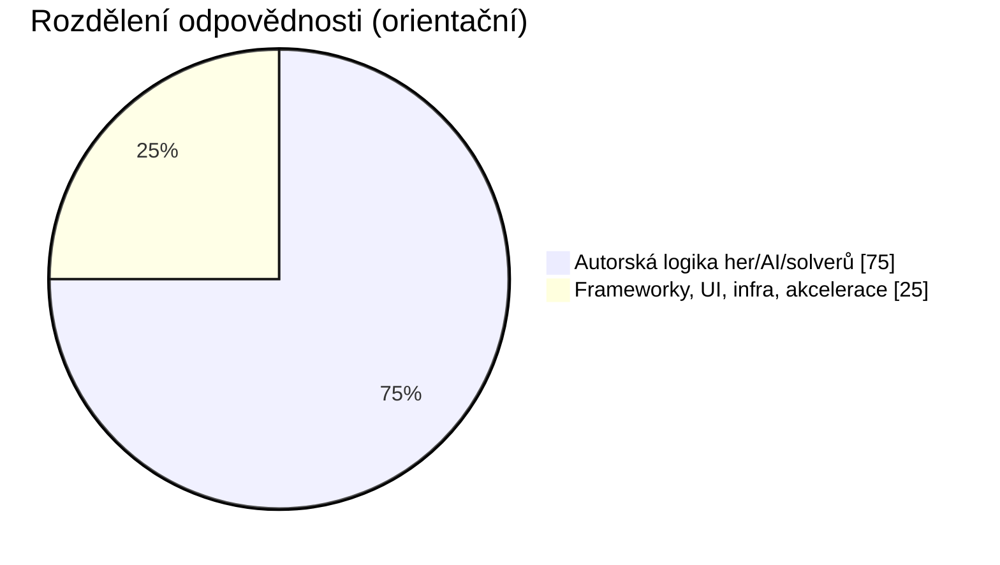

# Implementace Autora vs Knihovny

Tento dokument transparentně odděluje:

- co je implementované přímo v projektu (algoritmy, pravidla her, solvery, AI rozhodování),
- co je delegované na externí knihovny (GUI, SAT backend, numerická akcelerace, tooling).

Aktualizováno pro stav repozitáře k `2026-02-08`.

## 1. Rychlé Shrnutí

Poznámka: graf je orientační (není to LOC metrika), cílem je ukázat hranici odpovědností.

## 2. Hry a AI: Co je vlastní implementace

| Hra | Vlastní implementace (autor) | Knihovna role |
|---|---|---|
| 2048 | Expectimax + heuristiky hodnocení, adaptivní depth, výběr tahu | `numba` (JIT akcelerace), `numpy` (mřížka/výpočty) |
| Othello | Minimax + alpha-beta pruning + hodnoticí heuristiky | Bez AI frameworku, čistý Python |
| Piškvorky | Heuristiky + minimax/alpha-beta + transposition table | Volitelně `numba` fallback pattern, jinak Python |
| Sudoku | CSP/backtracking s MRV + bitmask optimalizace; uniqueness přes alternative-solution probe | Bez ML; pouze Python |
| KenKen | CSP solver: kandidáti klecí, propagace, branching | `numpy`/`numba` pro výkon; generátor používá vendored `calcudoku` |
| Nonogram | Line solver + propagace + branching při nejednoznačnosti | Bez externího AI engine |
| Mastermind | Minimax-like výběr tahu, redukce kandidátů | Bez externího AI engine |
| Slitherlink | Constraint logika + SAT modelování + validace smyčky | `python-sat` řeší SAT backend nad CNF modelem z projektu |
| Simon | Deterministický sequence engine (bez protivník AI) | Pouze UI/audio vrstva |

## 3. Knihovny: Co přesně delegují

| Knihovna | Co řeší | Co neřeší |
|---|---|---|
| `PySide6` | GUI (okna, widgety, signály, event loop, rendering) | Logiku pravidel/solverů her |
| `numpy` | Efektivní datové struktury a numerické operace | Strategická rozhodnutí AI |
| `numba` | Zrychlení hot-path funkcí (JIT) | Návrh algoritmů |
| `python-sat` | SAT solving backend (prohledávání CNF) | Model pravidel hry (CNF model tvoří projekt) |
| `pytest`, `hypothesis` | Testování a property-based testy | Produkční solver rozhodování |
| `ruff`, `mypy`, `pre-commit` | Kvalita kódu, statická kontrola | Runtime game logic |

## 4. Co Projekt Záměrně Nedělá

- Nepoužívá žádné trénované ML modely (`PyTorch`, `TensorFlow`, `scikit-learn`) pro herní AI.
- Nepoužívá LLM inference v runtime her.
- Není to wrapper nad externí “black-box AI” službou.

## 5. Důkazové Odkazy v Repu

- 2048 solver: `games/game2048/solver.py`
- Othello AI: `games/othello/engine.py`
- Piškvorky AI: `games/piskvorky/ai.py`
- Sudoku solver/generátor: `games/sudoku/engine.py`
- KenKen solver/generátor: `games/kenken/engine.py`
- Nonogram solver: `games/nonogram/engine.py`
- Mastermind strategie: `games/mastermind/engine.py`
- Slitherlink SAT pipeline: `games/slitherlink/engine.py`
- Audit claimů: `docs/solver_claims_audit.md`, `benchmarks/solver_claims_audit_2026-02-08.json`

## 6. Důležitá Nuance k Unikátnosti

- Sudoku: generátor používá kontrolu alternativního řešení proti referenčnímu řešení (ne klasické full-count v každém kroku).
- KenKen: aktuální generátor negarantuje uniqueness každého puzzle.
- Nonogram: generované puzzle je validní, uniqueness není tvrdě garantována ve všech případech.
- Slitherlink: uniqueness je kontrolovaná SAT pipeline.
